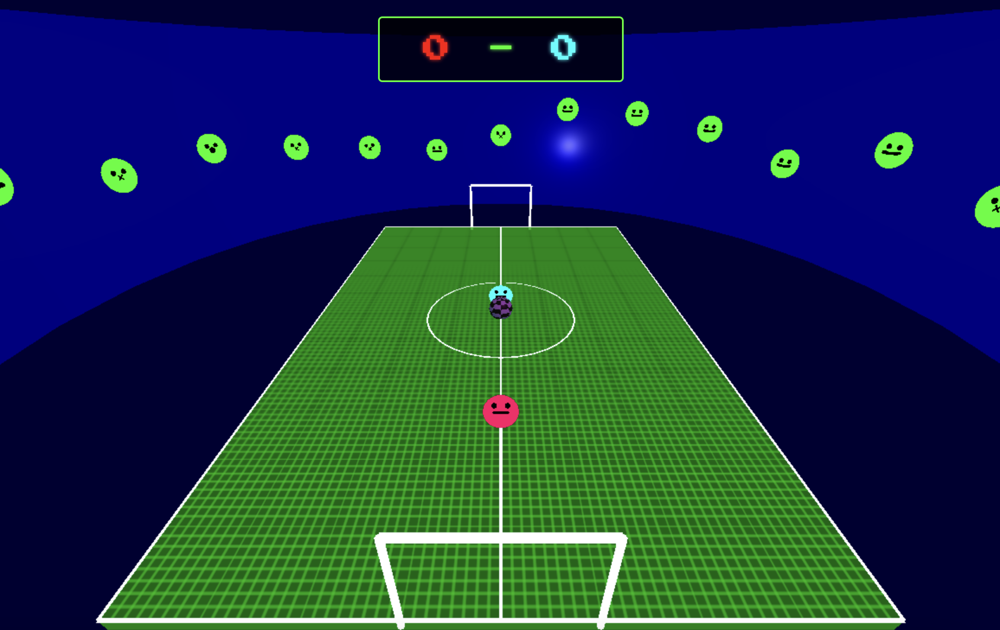

# Slime Soccer

A retro-style browser game where you play soccer as a slime! Built with Three.js and modern JavaScript.

🎮 [Play the Game](https://jaredmullane.github.io/cursor-slime/)



## Features

- Single player gameplay against AI
- Choose between Red and Blue slime characters
- Retro-style graphics with neon effects
- Mystery box power-up that spawns multiple balls
- Score tracking and win conditions (first to 10 points wins!)
- Responsive controls with keyboard input

## How to Play

1. Visit [https://jaredmullane.github.io/cursor-slime/](https://jaredmullane.github.io/cursor-slime/)
2. Choose your slime character (Red or Blue)
3. Use the following controls:
   - Arrow Keys: Move left/right
   - Space: Jump
   - First to 10 points wins!

## Local Development

1. Clone the repository:
```bash
git clone https://github.com/jaredmullane/cursor-slime.git
cd cursor-slime
```

2. Install dependencies:
```bash
npm install
```

3. Start the development server:
```bash
npm start
```

4. Open your browser and navigate to `http://localhost:5173`

## Technologies Used

- Three.js for 3D graphics and physics
- Vite for development and building
- Modern JavaScript (ES6+)
- CSS3 for styling and animations

## Contributing

Feel free to submit issues and enhancement requests!

## License

MIT License - feel free to use this code for your own projects! 